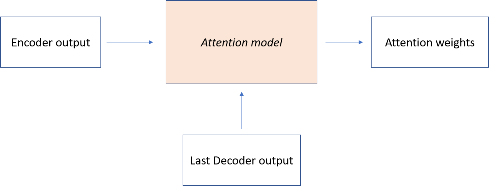
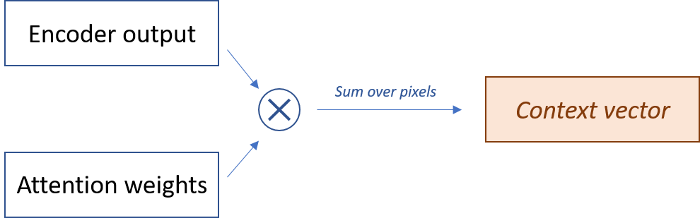
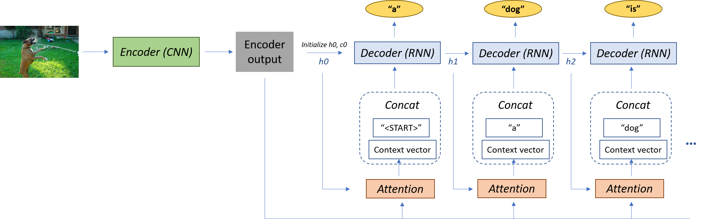
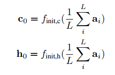
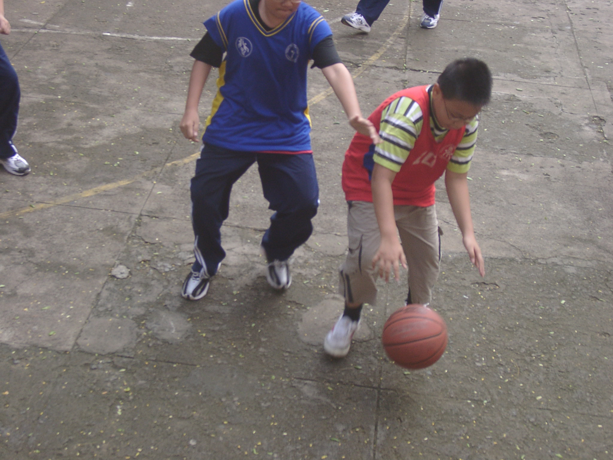

# Image Captioning
This is my implementation of image captioning with Attention. I use PyTorch throughout this repository since it is my favorite Deep Learning framework.

The paper which I refer to is [Show, Attend and Tell: Neural Image Caption Generation with Visual Attention](https://arxiv.org/abs/1502.03044) by Xu et al. Most of the concepts in this repository are taken from the paper, but there are some little differences in my implementation.

## Overview
### Dataset
Since I don't have a strong GPU for personal use, I use Google Colab. When it comes to dealing with large datasets with a huge number of files, it cannot handle so well. So instead of using big datasets like MSCOCO, I use Flickr8k dataset in this repository.

The images are first resized to smaller size of `224 x 224` and normalized to the mean = `[0.485, 0.456, 0.406]`, variance = `[0.229, 0.224, 0.225]`.

The raw captions are added `<START>` and `<END>` tokens and padded to the same length with `<PAD>`. After that they are encoded to vectors of indices so we can apply algorithms on them.

### Encoder-Decoder architecture
This type of model uses an Encoder to encode the input, then feed the encoded input to a Decoder, a type of sequence model, to generate word at each timestep. In this image captioning task, the input image is encoded by a Convolutional Neural Network. I use a pretrained VGG19 and strip the last classification layers, so the Encoder output will have a dimension of `512 x 7 x 7`.

The Decoder is a Recurrent Neural Network, it can be a RNN, GRU or LSTM. In this repo I use LSTM, the same as in the paper. If we don't use Attention, the Encoder output is simply fed as the first hidden state of the Decoder's LSTM. The LSTM uses predicted word from previous timestep to generate next word.

With Attention, at each timestep, the Decoder tends to focus more on particular pixels of the Encoder output. By this, it can generate more appropriate word.

### Attention
At each timestep, the Attention network will compute the weights for all pixels of the Encoder output. The Decoder will pay more attention to the pixels with bigger weights.

After these weights are calculated, they're then multiplied by the Encoder output. Summing this matrix over all pixels will we us a context vector.

The context vector is then concatenated with the embedded input word, forming the next Decoder input.

### Our complete model
Having all the necessary materials, here is our complete model :)

### Beam search
At decoding phase, predicted word is the one with highest probability, which is known as Greedy search. However, choosing the word with highest probability doesn't always ensure that it is the most optimal solution. For example, if the first predicted word has the highest score of `p1_1` and the next predicted word has the highest score of `p2_1`, the overall score of this sequence is `p1 = p1_1 * p2_1`. If we choose the first predicted word to have the third highest score `p1_2` and we choose the next predicted one to have the highest score `p2_2`, the overall score of this sequence is `p2 = p1_2 * p2_2`. As we can see, there are still chances that `p2` is greater than `p1`.

Unlike Greedy search, Beam search selects k best candidates at each timestep. With this technique, our Decoder can generate more complex and natural sentences (for the most time).

## Implementation notes
### Caption preprocessing
I get rid of all punctuation in train captions, add `<START>` and `<END>` tokens then extend these captions to the same length by adding some `<PAD>` tokens at the end of each caption. For example, `<START> A man be surf down a hill of sand <END> <PAD> <PAD> <PAD>`

After that, all words in these captions are encoded to numbers so that the model can work with them.

### Decoder
**Initial hidden state h0, c0**

According to the paper, we don't feed the Encoder's output to be the Decoder's initial hidden state directly, since the Encoder's output may have different dimension from our Decoder hidden size. The paper suggests that we compute the mean of Encoder's output over pixels, then feed this mean matrix to a MLP. The output of the MLP is also the first hidden state and cell state of the Decoder.

### Training
I trained my model using CrossEntropyLoss as my loss function, and Adam as the optimizer. And I decrease my learning rate by 0.8 times every epoch using lr_scheduler from PyTorch. At training phase, **teacher forcing** is used, which means that the input words fed into Decoder model are taken from the ground-truth train captions, not from our prediction.

### Inference
At test time, **teacher forcing** is not used because we don't know the ground-truth captions yet. So at each timestep, the input to the Decoder are taken from previous prediction.

### Beam search
I use beam search only at test time. If we're using Beam search at train time, our loss function has to be changed because CrossEntropyLoss calculates the loss between the value with highest score and ground-truth label, whereas Beam search takes `k` values into account.

To be noted that in my implementation, I don't compute overall score by taking product of score. Instead, I take the log of score then compute sum of these logs. According to **Prof. Andrew Ng**'s explanation in his **Sequence Models** course, computing the product of tiny numbers can result in **numerical underflow**, so computing sum of logs will be less prone to this problem. I think this issue is only considerable when output scores are very small values.

In other words, to maximize `P = P1 * P2 * P3 * ...`, we can maximize `log(P) = log(P1) + log(P2) + log(P3) + ...` instead.

## Some examples
* **Picture 1**

Beam Size | Generated caption
:---: | :---:
1 | a boy in a red shirt is playing with a soccer ball
3 | a boy in a red shirt is playing with a soccer ball
5 | two young children playing soccer on the pavement
7 | a boy in a red shirt is playing with a soccer ball on the ground

* **Picture 2**

Beam Size | Generated caption
:---: | :---:
1 | a group of people are standing in front of a statue
3 | a group of people are standing in front of a statue on a bench
5 | a group of young men are sitting on a bench in front of a building with a man in the background
7 | a group of young men stand on a sidewalk in front of a group of people on a sunny day

* **Picture 3**

Beam Size | Generated caption
:---: | :---:
1 | two children play in a pool with a ball in a pool
3 | two children play in a pool with a ball in a pool
5 | two children play in a pool with a ball in the background
7 | two children play in a swimming pool with a ball in the background

We can see that with larger beam size, the output captions seem to be more complex and appropriate in many cases (not all).

## Future works
I haven't implemented a validation metric in this repository yet. Maybe in the future I'll use BLEU score for validation and early stopping.

## References
1. *Kelvin Xu, Jimmy Ba, Ryan Kiros, Kyunghyun Cho, Aaron Courville, Ruslan Salakhutdinov, Richard Zemel, Yoshua Bengio (2015).* [Show, Attend and Tell: Neural Image Caption Generation with Visual Attention](https://arxiv.org/abs/1502.03044).
2. *Dzmitry Bahdanau, Kyunghyun Cho, Yoshua Bengio (2014)*. [Neural Machine Translation by Jointly Learning to Align and Translate](https://arxiv.org/abs/1409.0473) (for detailed math explanation).
3. https://github.com/sgrvinod/a-PyTorch-Tutorial-to-Image-Captioning.
4. [RNN lecture from Stanford University CS231n](http://cs231n.stanford.edu/syllabus.html).
5. [Week 3 of the Sequence Models course from Coursera](https://www.coursera.org/learn/nlp-sequence-models/home/week/3).
